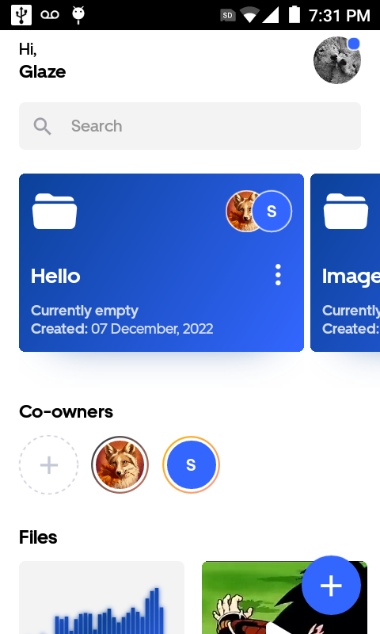
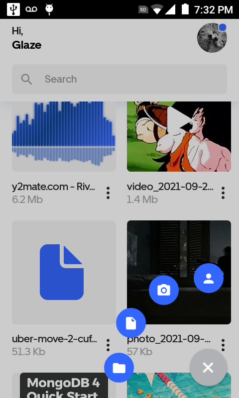
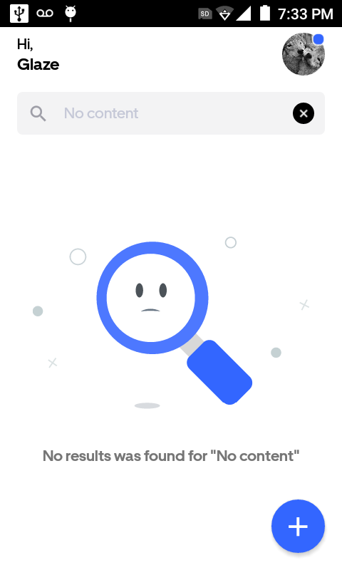
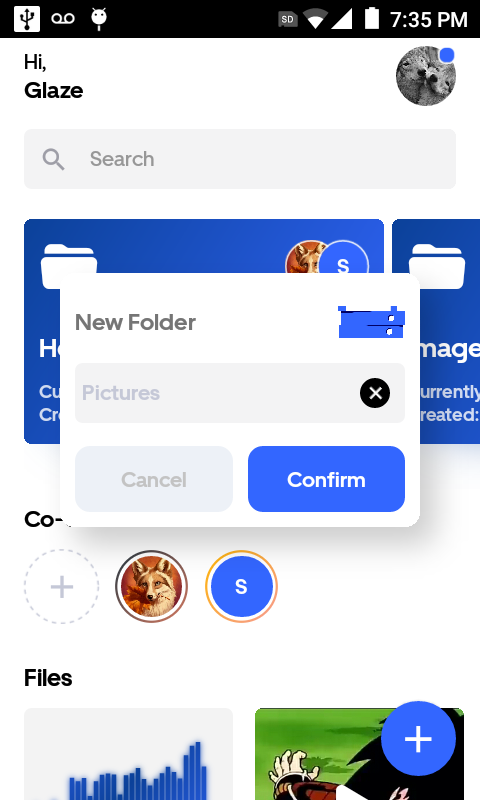
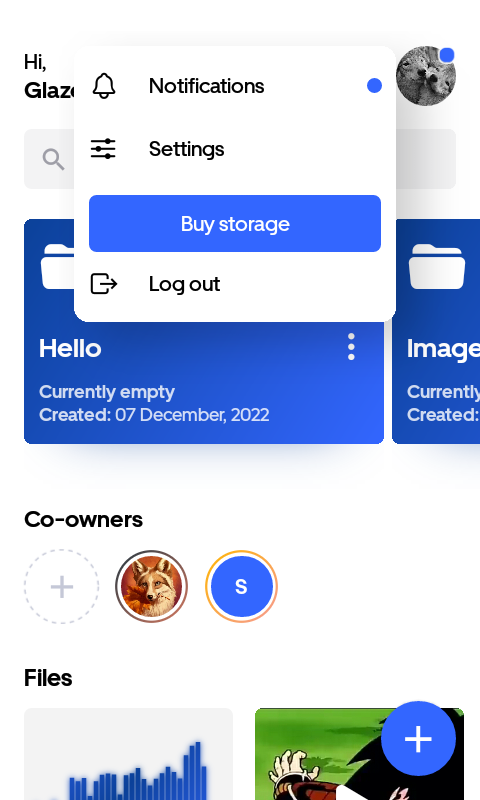
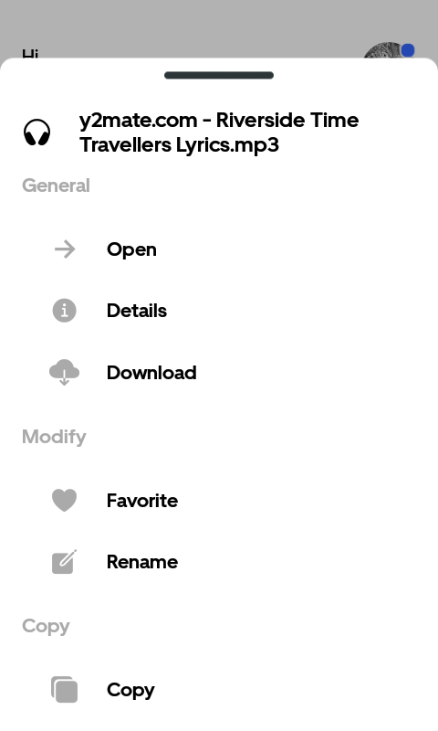
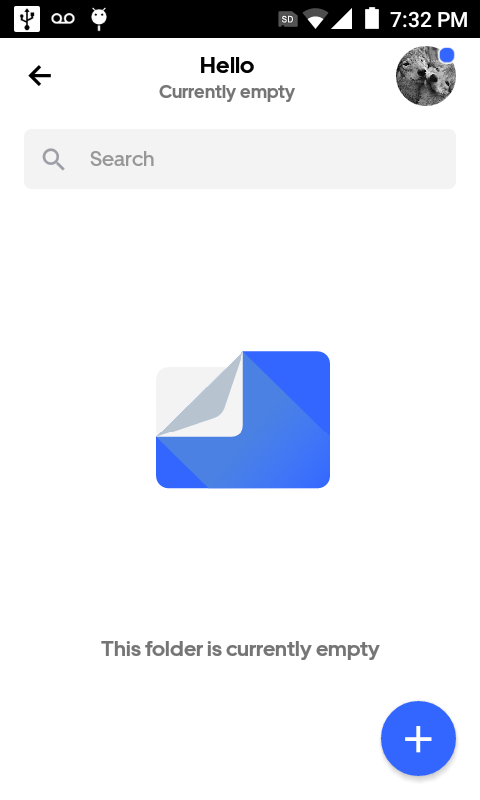
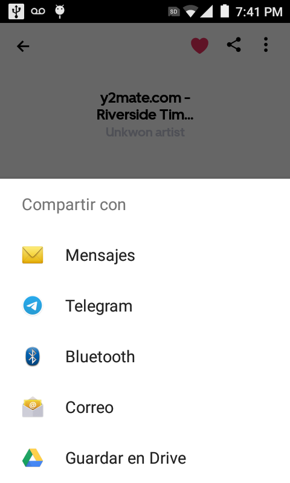
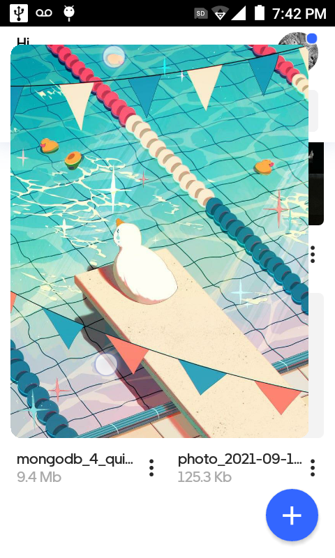
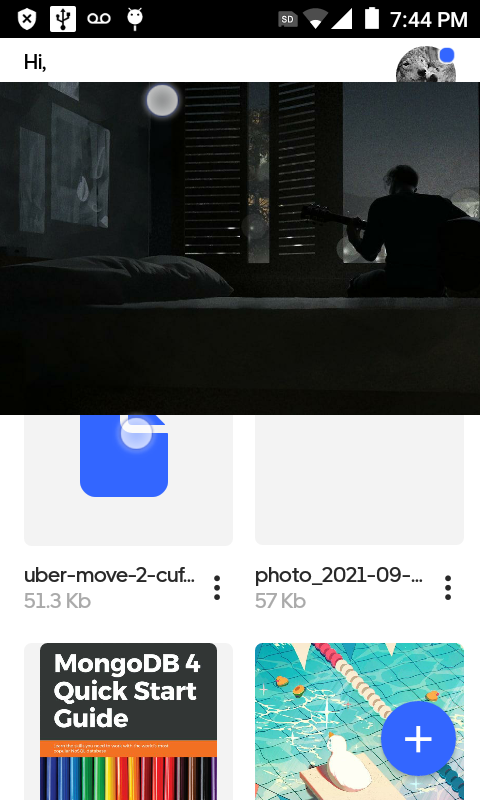

## Kio mobile app

### About

Kio mobile app is a [React Native](https://reactnative.dev/) based application and a file manager application.

I found a file manager application to be a very interesting project idea, as you can get very creative with it, from just simply storing the files to play and share them!

Here are so features!

- Storage all your files
- Share with other users
- Visualize all your audio, video, pdf and images files
- Share files with other apps

### What I've learned

- Work with big projects, up to day this is my biggest project and I've enjoyed all the journey
- Recursion, cloud file maganers handle files just the same way as your computer file system would, so making changes to folders or deleting them will cascade these actions to all inner folder and files
- Animations, all gestures and animations have been created by hand, for instance pinc to zoom, image cropper features and scrollable bottom sheet features
- Skia, grasp the basics of how to paint items on skia canvas thanks to [React native skia](https://shopify.github.io/react-native-skia/)

### Footage

#### Onboarding

### Home

