## Kio mobile app

### About

Kio mobile app is a [React Native](https://reactnative.dev/) based application and a file manager application that works along with my [Kio backend project](https://github.com/Glazzes/kio).

I found a file manager application to be a very interesting project idea, as you can get very creative with it with the amount of features you can add to it, this project sticks to the core idea tho, as i think it's more than enough for a side project.

Here are so features!

- Storage all your files
- Share with other users
- Share files with other apps
- Visualize all your audio, video, pdf and images files
- Visualize details of all your files, including dimensions, duration, size, number of pages and more!
- Pinch & pan to zoom pictures before seeing in full screen
- Audio waveforms for audio files through [BBC's audiowaveform](https://github.com/bbc/audiowaveform) project
- Picture in picture videos, watch all of your videos while navigating through the app!
- Select multiple files and folders
  - Copy and cut them within any other folder as you'd in any file system
  - Download all of them at once
  - Delete all of them at once

### What I've learned

- Work with big projects, up to day this is my biggest project and I've enjoyed all the journey
- Recursion, cloud file maganers handle files just the same way as your computer file system would, so making changes to folders or deleting them will cascade these actions to all inner folder and files
- Animations, all gestures and animations have been created by hand, for instance pinc to zoom, image cropper features and scrollable bottom sheet features
- Skia, grasp the basics of how to paint items on skia canvas thanks to [React native skia](https://shopify.github.io/react-native-skia/)

### Footage

##### Onboarding

[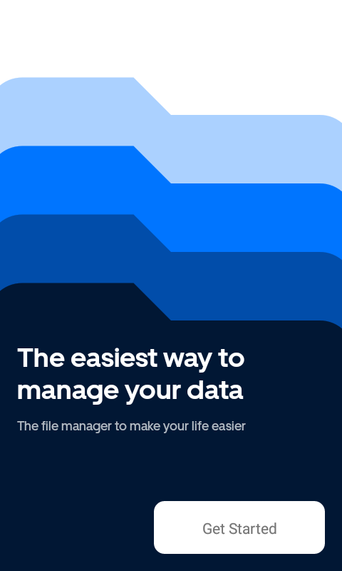](")
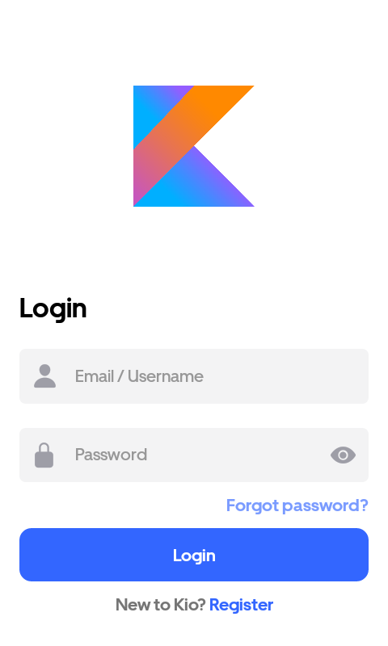
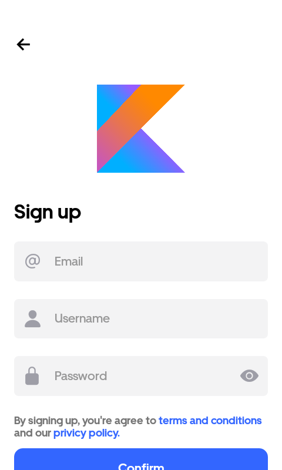
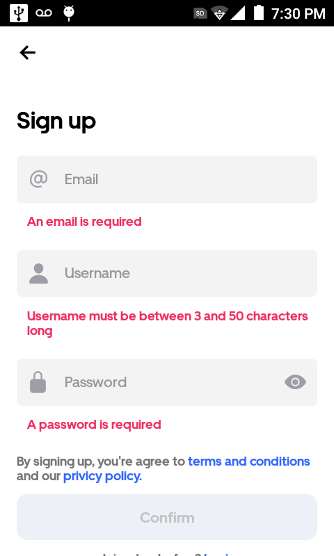
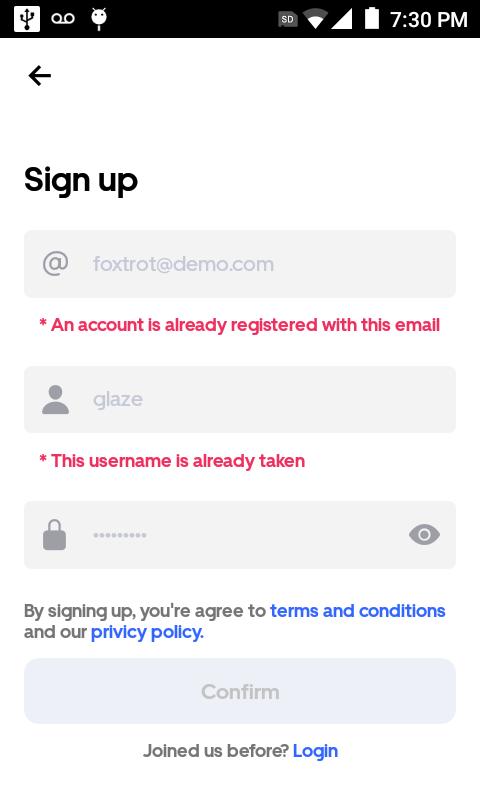

##### Main screen

[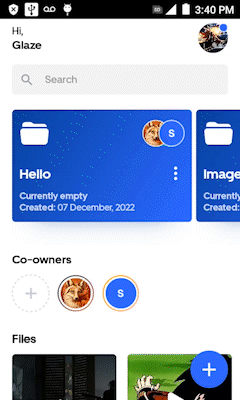]("")

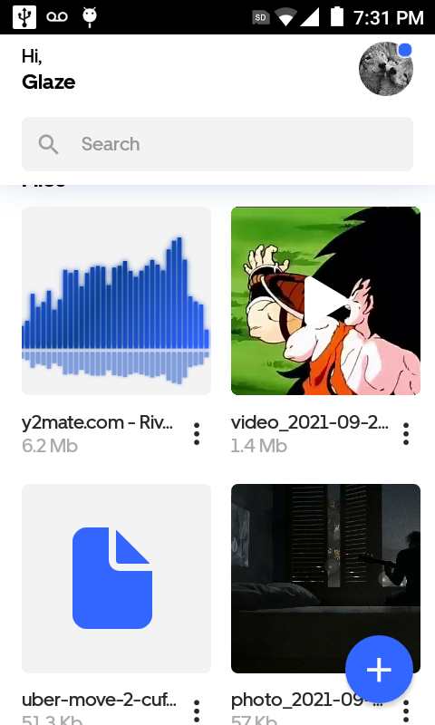
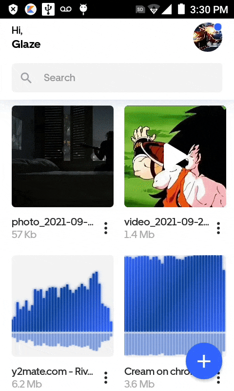
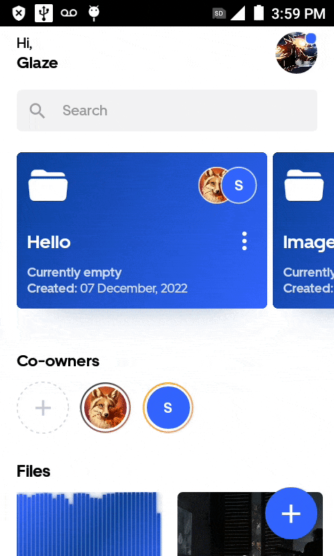
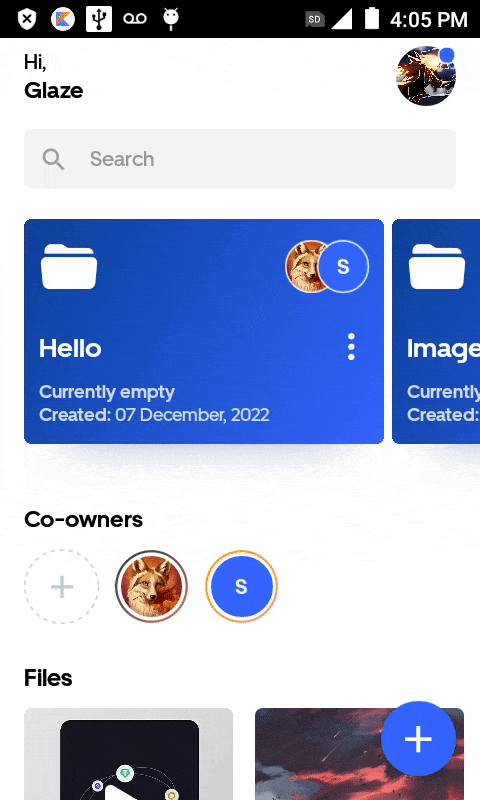
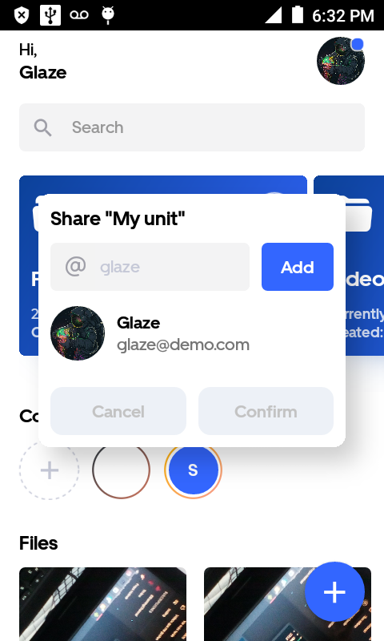

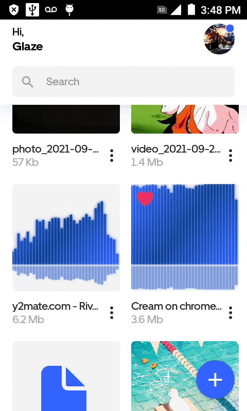
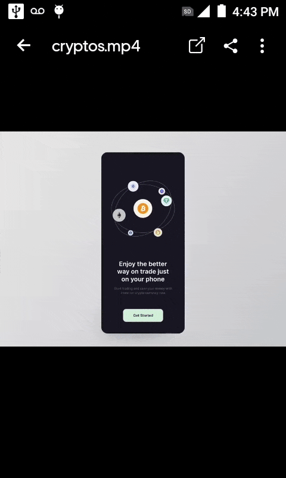

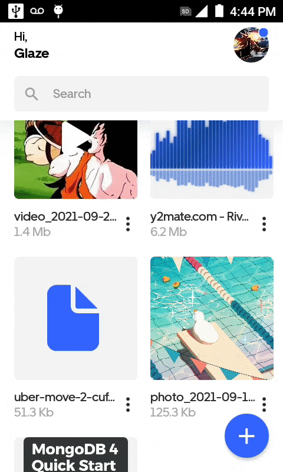

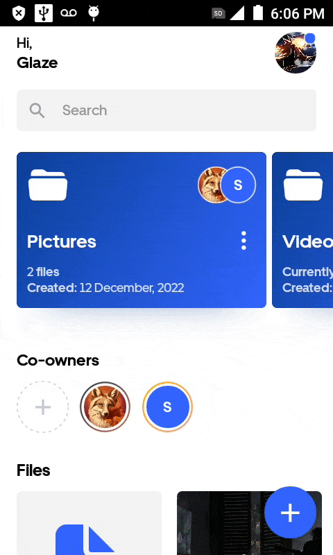

##### Camera

[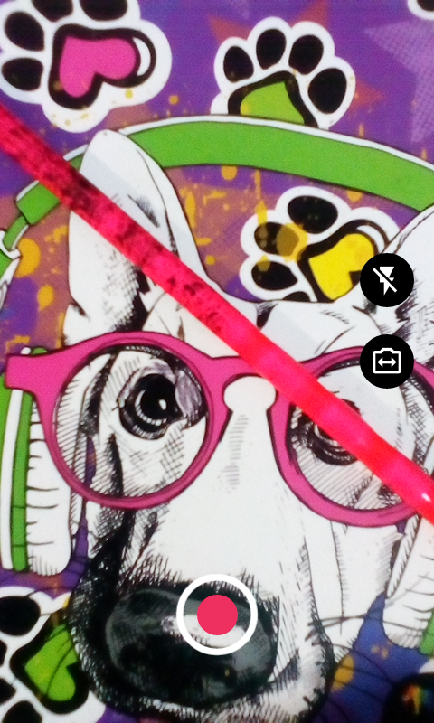](")
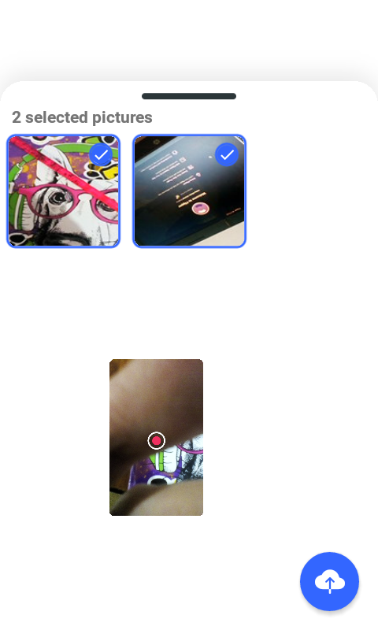
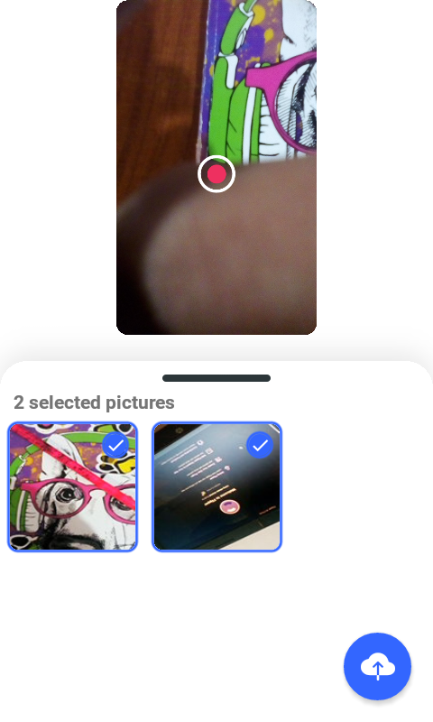
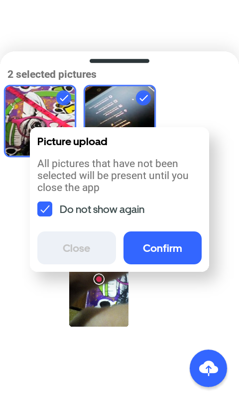

##### Settings

[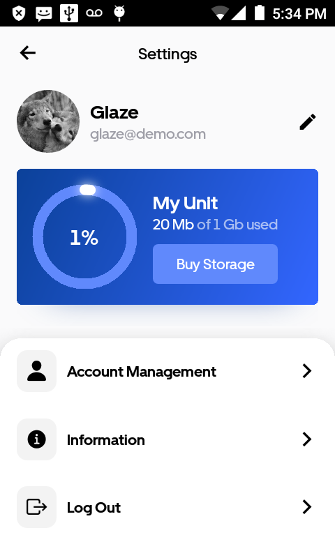]("")
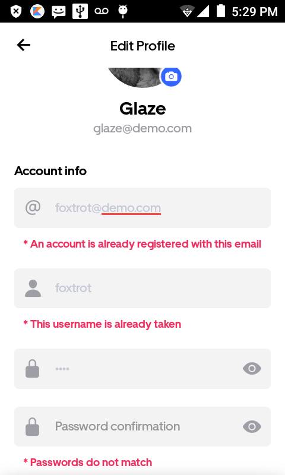
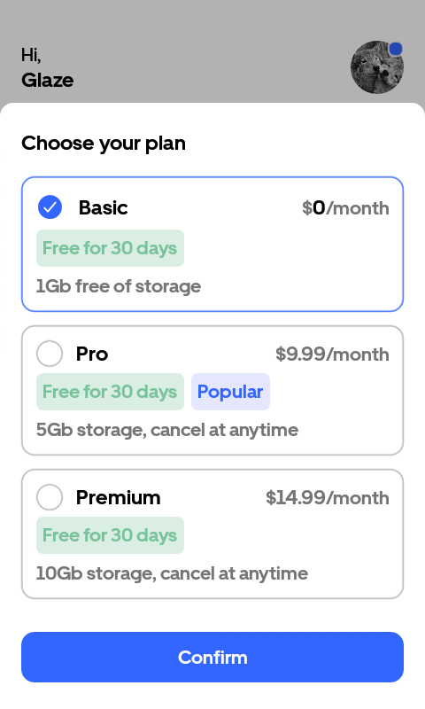

